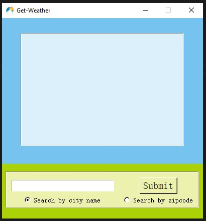

# Get-Weather


## Introduction
This project is about creating a Get-Weather with simple to use GUI. This application helps you to get the weather details for different cities from city name or zipcode


## Getting started
In order to run this script, you need to have Python and pip installed on your system. After you're done installing Python and pip, run the following command from your terminal to install the requirements from the same folder (directory) of the project.
```
pip install -r requirements.txt
```

## Getting and Replacing API
Get to the "api.openweathermap.org" and create yourown API. Relace the line number 30 in "weather.py" with your-own API Key.

After satisfying all the requirements for the project, Open the terminal in the project folder and run
```
python weather.py
```
or
```
python3 weather.py
```
depending upon the python version. Make sure that you are running the command from the same virtual environment in which the required modules are installed.




Now you are all set to explore the Get-Weather. Happy Hacking!!!!!!


## Reporting Bugs
Feel free to report any buys or issues at the below github profile.
Check out my Github profile [a-k-r-a-k-r](https://github.com/a-k-r-a-k-r)
